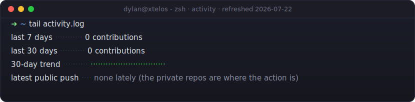

<picture>
  <source media="(prefers-color-scheme: dark)" srcset="assets/hero-dark.svg">
  <source media="(prefers-color-scheme: light)" srcset="assets/hero-light.svg">
  
</picture>

Full-stack developer at Software Consulting Services, building and modernizing the software newspapers use to sell and produce advertising. I lean front-end but work the whole stack, and the work I'm proudest of is the load-bearing kind: two-factor auth, payment processing, and a generative-AI tool that makes print-ready ad artwork. Reliability first, because that's the part people only notice when it's missing.

Commitment issues? Not me. I commit early, commit often, and only occasionally force-push something I'll regret.

## ➜ ls ~/tools

I run AI coding agents against real production codebases, and I got tired of "trust me, it works." So I built a fleet of verification tools. Each one turns a category of guesswork into a measured verdict.

| tool | what it does |
| --- | --- |
| **argus** | Call-and-impact graph for a million-line legacy codebase. Answers "what breaks if I change this?" in seconds, with cited `file:line` receipts instead of a grep sweep. |
| **aegis** | Build-trust engine. Syncs, compiles on the real build host, harvests the actual compiler errors. Never reports a false green: unparsed and unverified are never a pass. |
| **iris** | Headless visual verification over the Chrome DevTools Protocol. Screenshots with a verdict attached, console errors captured at the protocol level, and bounce tests that catch canvas apps dying on remount. |
| **demeter** | Dev-database harness. Stands up, seeds, and tears down per-stack databases, and never wipes the thing you cannot rebuild. |
| **ariadne** | Long-effort tracker. Reports the next pending session and the drift between what the tracker claims and what git says actually happened. |
| **delphi** | Personal knowledge engine. A linked note graph with scored memory recall, so hard-won context survives from one working session to the next. |

Plus **momus**, an adversarial reviewer that assumes my change is broken and tries to prove it before anything gets called done. Source private while they grow up; ask me about any of them.

## ➜ tail shipped.log

```text
[auth]      Multi-method 2FA end to end: authenticator-app TOTP, SMS, email,
            30-day trusted devices. Live across 90+ newspaper sites.
[payments]  Provider-agnostic payment layer (Stripe, Square). Led a processor
            migration with per-customer routing and a safe, re-runnable job
            moving stored cards into a token vault.
[genai]     Print-ready ad artwork from a text prompt: three interchangeable
            image models behind one interface, OCR text handling, and an
            automated check that rejects unusable output before it ships.
[adtech]    Google Ad Manager integration: line items, advertisers, and
            creatives created straight from order entry.
[solo]      Multi-tenant classified-ads marketplace, sole developer: ad
            builder, checkout funnel, payments, approvals, email.
```

## ➜ tail activity.log

<picture>
  <source media="(prefers-color-scheme: dark)" srcset="assets/activity-dark.svg">
  <source media="(prefers-color-scheme: light)" srcset="assets/activity-light.svg">
  
</picture>

## ➜ cat stack.txt

```text
languages   JavaScript · TypeScript · Python · PHP · SQL
frontend    React · Next.js · single-page apps that stay fast
backend     Node.js · Flask · Express · REST and JSON-RPC APIs
data        PostgreSQL · MySQL · MongoDB · Redis
infra       AWS · Docker · CI/CD · Linux
ai          LLM integration · image generation · speech to text
```

## ➜ cat contact.txt

- **LinkedIn:** [linkedin.com/in/dylan-fodor](https://www.linkedin.com/in/dylan-fodor/)
- **Email:** [df4182@gmail.com](mailto:df4182@gmail.com)
